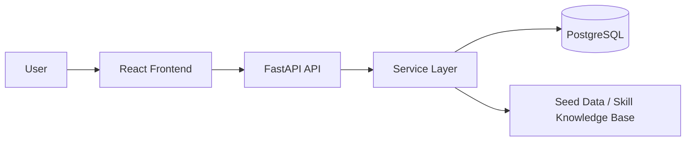

# CareerLens

> Graph-powered career guidance for students and early-career professionals who want to turn a resume into job matches and a practical learning roadmap.

## Executive Summary

CareerLens is an early-stage web application that helps users analyze a resume, extract relevant skills, compare those skills against a curated job market dataset, and receive a prioritized roadmap for closing gaps. The current repository contains a working backend foundation for authentication, resume upload, skill extraction, job scoring, and roadmap generation, while the frontend is still in an early UI shell stage. The project is best described as an Alpha/MVP foundation rather than a production-ready product.

- Current Status: 🟨 Active Development
- Estimated Completion: ~65%
- Target: MVP foundation
- Last Verified: 2026-07-11

---

## What Problem It Solves

Many students and recent graduates struggle to translate a resume into a clear next step. CareerLens aims to answer three questions:

1. Which jobs am I well aligned to?
2. Which skills am I missing for those roles?
3. What should I learn next, in what order, and how long will it take?

The system combines resume parsing, skill normalization, job matching, and roadmap generation into a single experience.

---

## How the Project Works

In simple terms, the user flow is:

1. A user creates an account and logs in.
2. The user uploads a resume.
3. The backend extracts text from the resume and matches known skills from a seed dataset.
4. The recommendation engine scores jobs using the extracted skills and basic demand signals.
5. The roadmap generator suggests the most impactful missing skills to learn next.

The current implementation is intentionally lightweight and rule-based rather than fully semantic or graph-driven.

---

## Technology Stack

| Layer | Technologies |
|---|---|
| Backend | FastAPI, Python 3.11, SQLAlchemy, Pydantic, Alembic |
| Database | PostgreSQL |
| Auth | JWT, bcrypt, passlib, python-jose |
| NLP | spaCy, PyMuPDF, python-docx |
| ML / Graph | scikit-learn, numpy, pandas, networkx |
| Frontend | React, TypeScript, Vite, Tailwind CSS, React Router, Zustand, Axios |
| Data | JSON seed files for skills, edges, and jobs |
| DevOps | Docker Compose |

---

## Architecture Overview

The system is split into a React frontend, a FastAPI backend, and a PostgreSQL database. The backend routes accept requests, use dependency injection for database sessions and authenticated users, and call service-layer logic for parsing, scoring, and roadmap generation.



---

## Repository Structure

```text
careerlens/
├── backend/
│   ├── app/
│   │   ├── api/routes/        # API endpoints
│   │   ├── core/              # config, auth, dependency helpers
│   │   ├── db/                # database engine, models, seed
│   │   ├── schemas/           # request/response DTOs
│   │   └── services/          # NLP, graph, recommendation, roadmap
│   ├── alembic/               # database migrations
│   ├── data/seed/             # seed JSON files
│   ├── tests/                 # test suite skeleton
│   └── requirements.txt
├── frontend/
│   ├── src/
│   │   ├── pages/             # login, register, dashboard, jobs, roadmap
│   │   ├── services/          # API client layer
│   │   ├── store/             # auth state
│   │   └── types/             # shared TS types
├── docs/                      # architecture and research notes
├── docker-compose.yml         # local container orchestration
└── .env.example               # environment configuration template
```

---

## Development Progress Dashboard

Overall Progress: ████████████░░░░░░░░ 65%

| Area | Status | Notes |
|---|---|---|
| Planning | ✅ Complete | Core product scope is defined. |
| Architecture | ✅ Complete | Backend/frontend split and domain modules are in place. |
| Backend | 🟨 In Progress (75%) | Core routes and services exist; some modules are still simple. |
| Frontend | 🟩 Mostly Complete (40%) | Pages exist as shells; no full UI flows yet. |
| Authentication | ✅ Complete | Register/login/me endpoints and JWT helpers are implemented. |
| Database | ✅ Complete | ORM models and Alembic migration structure exist. |
| API | 🟨 In Progress | Core endpoints are implemented; jobs/users routes are still stubs. |
| Testing | 🟥 Minimal | No meaningful automated tests are present yet. |
| Deployment | 🟥 Not Started | Docker compose exists, but production deployment is not configured. |
| Documentation | 🟨 In Progress | Architecture notes exist, but README needed consolidation. |

---

## Milestone Timeline

- ✅ Milestone 1 — Project bootstrap and folder structure
- ✅ Milestone 2 — Backend API skeleton and database models
- ✅ Milestone 3 — Authentication, JWT, and resume upload flow
- ✅ Milestone 4 — Basic skill matching and job recommendation engine
- 🟨 Milestone 5 — Frontend integration and richer dashboard experience
- ⬜ Milestone 6 — Production readiness, CI/CD, and deployment

---

## Feature Status

| Feature | Status | Completion | Notes |
|---|---|---:|---|
| User Registration | ✅ | 100% | Backend endpoint exists and hashes passwords. |
| User Login | ✅ | 100% | JWT issuance and validation are implemented. |
| Resume Upload | ✅ | 100% | PDF/DOCX/TXT supported; text extraction and skill matching work. |
| Skill Extraction | ✅ | 90% | Keyword/regex matching is implemented and seeded. |
| Job Recommendations | ✅ | 85% | Basic overlap + demand scoring is implemented. |
| Roadmap Generation | ✅ | 80% | Missing-skill ranking is implemented. |
| Dashboard UI | 🟨 | 30% | Page exists, but content is placeholder-only. |
| Jobs UI | 🟨 | 20% | Page exists, but no real data loading. |
| Roadmap UI | 🟨 | 20% | Page exists, but no real data loading. |
| Testing | 🟥 | 10% | Test suite is effectively empty. |
| Deployment Automation | 🟥 | 0% | No CI/CD or production deployment configuration. |

---

## Implemented Features

### Backend

- FastAPI app bootstrap with CORS and mounted routers
- JWT-based authentication flow with register/login/me routes
- Database session and ORM model layer via SQLAlchemy
- Alembic migration support
- Resume upload endpoint supporting PDF, DOCX, and TXT files
- Skill extraction from raw resume text using a seeded lookup table
- Basic job recommendation scoring based on overlap and market demand
- Basic roadmap generation that ranks missing skills by impact
- Seed scripts for skills, edges, and jobs

### Frontend

- React + Vite application shell
- Routing for login, registration, dashboard, jobs, and roadmap pages
- Shared API client configuration and auth storage helper

---

## Currently Under Development

The following areas are active or incomplete:

- Frontend page implementation and real API integration
- Jobs and users API route modules remain stubbed
- Recommendation and roadmap logic are intentionally basic and not yet graph- or semantic-rich
- End-to-end user flows from login to dashboard are not yet wired up
- Test coverage is not yet established

---

## Planned or Missing Features

- Rich analytics dashboard with charts and user progress summaries
- Better resume parsing using NLP models and richer entity extraction
- Graph-based prerequisite reasoning for roadmap sequencing
- Notifications and reminders
- Report/export features
- Admin tools and moderation workflows
- Production deployment, CI/CD, and monitoring

---

## API Endpoints

| Method | Route | Status | Purpose |
|---|---|---|---|
| GET | / | ✅ | Service health check |
| POST | /api/auth/register | ✅ | Create a new user |
| POST | /api/auth/login | ✅ | Issue a JWT |
| GET | /api/auth/me | ✅ | Fetch current authenticated user |
| GET | /api/recommendations | ✅ | Return scored job recommendations |
| GET | /api/roadmap | ✅ | Return a ranked roadmap |
| POST | /api/resume/upload | ✅ | Upload and parse a resume |
| GET | /api/jobs | 🟨 | Present but not implemented |
| GET | /api/users | 🟨 | Present but not implemented |

---

## Database Schema and Relationships

The main entities are:

- User: stores account identity, profile metadata, and target role
- CandidateProfile: one profile per user, storing raw resume text and extracted skills
- Skill: canonical skill definitions with aliases, category, and demand values
- SkillEdge: directed prerequisite-like relationship between skills
- Job: job postings with required skills and metadata
- Recommendation: stores calculated recommendation scores for a user/job pair
- Roadmap: stores the generated roadmap summary for a user

### Relationship Summary

- One User has many CandidateProfiles
- One User has many Recommendations
- One User has many Roadmaps
- Skills and jobs are linked through the required_skills JSON field in jobs
- SkillEdge represents relationships between skills

---

## Environment Variables

Create a local .env file based on [.env.example](.env.example).

| Variable | Required | Description |
|---|---|---|
| DATABASE_URL | Yes | PostgreSQL connection string |
| SECRET_KEY | Yes | Secret used to sign JWTs |
| ALGORITHM | No | JWT algorithm, defaults to HS256 |
| ACCESS_TOKEN_EXPIRE_MINUTES | No | Token lifetime in minutes |
| VITE_API_BASE_URL | Yes for frontend | Base URL for the backend API |

---

## Installation and Local Setup

### 1) Clone and enter the repository

```bash
git clone <repo-url>
cd careerlens
```

### 2) Create environment files

```bash
cp .env.example .env
```

Update the values in .env as needed. The backend expects DATABASE_URL and SECRET_KEY to be present.

### 3) Start the database

```bash
docker compose up -d postgres
```

### 4) Install backend dependencies

```bash
cd backend
python3 -m venv .venv
source .venv/bin/activate
pip install -r requirements.txt
```

### 5) Run database migrations

```bash
alembic upgrade head
```

### 6) Seed the knowledge base

```bash
python -m app.db.seed
```

### 7) Start the backend

```bash
uvicorn app.main:app --reload --host 0.0.0.0 --port 8000
```

### 8) Start the frontend

```bash
cd ../frontend
npm install
npm run dev
```

The frontend should be available at http://localhost:5173 and the API at http://localhost:8000/docs.

---

## Build and Deployment

### Local Build

```bash
cd frontend
npm run build
```

### Containerized Run

```bash
docker compose up --build
```

### Deployment Status

Deployment is not yet automated or production-ready. The current repository includes Docker Compose for local orchestration, but CI/CD, monitoring, and production environment configuration are still pending.

---

## Testing Strategy and Current Coverage

Current test coverage is minimal. The repository contains a placeholder test file at [backend/tests/test_graph.py](backend/tests/test_graph.py), and a verification run showed that no tests are currently executed.

### Verified status

- Pytest command run: no tests were discovered
- Frontend build has not been verified in this session

### Recommended next testing steps

- Add API tests for auth, resume upload, recommendations, and roadmap routes
- Add frontend component tests for page rendering and navigation
- Add database seeding and migration smoke tests

---

## Known Bugs and Technical Debt

- The frontend pages are UI placeholders rather than complete user flows
- The jobs and users routes are still empty stubs
- Recommendation and roadmap logic are intentionally simple and do not yet use full graph reasoning or semantic similarity
- The backend currently relies on seeded JSON data rather than a richer knowledge graph
- No automated test suite or CI pipeline is in place
- Production deployment configuration is not present

---

## TODOs and FIXMEs

No explicit TODO/FIXME comments were found in the core implementation. However, the project still contains several obvious incomplete areas:

- Implement real frontend data wiring for dashboard, jobs, and roadmap screens
- Flesh out the jobs and users API modules
- Replace rule-based matching with richer NLP and graph logic
- Add tests and CI
- Add deployment and monitoring configuration

---

## Code Quality Observations

The repository is structured well for a growing product:

- Clear separation between API, core, database, schemas, and services
- Dependency injection and typed schemas are used consistently
- The backend modules are reasonably modular and easy to extend
- The main gaps are functional completeness and verification, not architecture quality

---

## Highest-Priority Next Tasks

1. Finish the frontend experience for dashboard, jobs, and roadmap
2. Wire the frontend to the real backend endpoints
3. Add API validation and error handling coverage
4. Add tests for authentication and resume upload flows
5. Introduce richer recommendation and roadmap logic

---

## Prioritized Roadmap

### Immediate
- Finish dashboard and roadmap UI flows
- Complete API validation and error responses
- Add authentication and resume-upload tests

### Next Sprint
- Add richer analytics and reporting views
- Improve recommendation explanations
- Introduce notifications and user progress tracking

### Future
- Add performance tuning and caching
- Add monitoring and observability
- Implement production deployment and CI/CD

---

## Current Development Snapshot

- Where am I right now? The project is in an Alpha/MVP foundation phase with working backend flows and early frontend scaffolding.
- What was the last major thing completed? Resume upload, skill extraction, basic job recommendations, and roadmap generation were added.
- What should I work on next? Finish the frontend integration and add automated tests.
- What blockers exist? The UI is still mostly placeholder-based, and there are no meaningful tests or deployment pipelines yet.
- How close is the project to MVP? Moderately close on backend fundamentals, but still incomplete on product experience and verification.
- How close is it to Production? Not close yet; deployment and operational maturity are still missing.

---

## Developer Handoff

To continue development efficiently, start with the frontend integration layer and the missing API modules. The backend already has the essential domain flows in place, so the next value comes from connecting them to a real user experience and validating them with tests. A good next milestone is to make the dashboard and roadmap pages functional end-to-end using the existing auth, resume upload, recommendations, and roadmap endpoints.

---

## Notes

This README is intended to be updated after each development session. It reflects the current repository state as of 2026-07-11 and should be revised whenever major features are implemented or removed.
