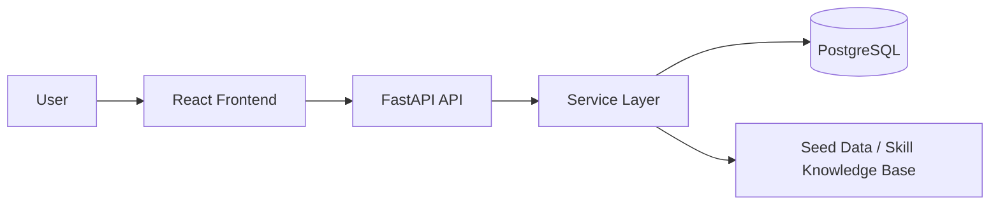

# CareerLens

> Graph-powered career guidance for students and early-career professionals who want to turn a resume into job matches and a practical learning roadmap.

## Executive Summary

CareerLens is a working web application that helps users analyze a resume, extract relevant skills, compare those skills against a curated job market dataset, and receive a prioritized roadmap for closing gaps. A user can go end to end today: register, log in, upload a resume, and watch all seven analysis stages run and render progressively. Scoring is an explainable hybrid of three signals (TF-IDF text similarity, skill-graph proximity, and market demand), and every score exposes its component breakdown. The backend and frontend are both implemented and covered by an automated test suite running in CI; what remains is a live public deployment.

- Current Status: 🟩 Feature Complete (pending public deployment)
- Estimated Completion: ~90%
- Target: MVP foundation
- Last Verified: 2026-07-27

---

## What Problem It Solves

Many students and recent graduates struggle to translate a resume into a clear next step. CareerLens aims to answer three questions:

1. Which jobs am I well aligned to?
2. Which skills am I missing for those roles?
3. What should I learn next, in what order, and how long will it take?

The system combines resume parsing, skill normalization, job matching, and roadmap generation into a single experience.

---

## How the Project Works

In simple terms, the user flow is:

1. A user creates an account and logs in.
2. The user uploads a resume.
3. The backend extracts text from the resume and matches known skills from a seed dataset.
4. The recommendation engine scores jobs using the extracted skills and basic demand signals.
5. The roadmap generator suggests the most impactful missing skills to learn next.

The current implementation is intentionally lightweight and rule-based rather than fully semantic or graph-driven.

---

## Technology Stack

| Layer | Technologies |
|---|---|
| Backend | FastAPI, Python 3.11, SQLAlchemy, Pydantic, Alembic |
| Database | PostgreSQL |
| Auth | JWT, bcrypt, passlib, python-jose |
| NLP | spaCy, PyMuPDF, python-docx |
| ML / Graph | scikit-learn, numpy, pandas, networkx |
| Frontend | React, TypeScript, Vite, Tailwind CSS, React Router, Zustand, Axios |
| Data | JSON seed files for skills, edges, and jobs |
| DevOps | Docker, Docker Compose, Caddy, GitHub Actions |

---

## Architecture Overview

The system is split into a React frontend, a FastAPI backend, and a PostgreSQL database. The backend routes accept requests, use dependency injection for database sessions and authenticated users, and call service-layer logic for parsing, scoring, and roadmap generation.


```mermaid
flowchart LR
    U[User] --> F[React Frontend]
    F --> A[FastAPI API]
    A --> S[Service Layer]
    S --> D[(PostgreSQL)]
    S --> SD[Seed Data / Skill Knowledge Base]
```

---

## Repository Structure

```text
careerlens/
├── backend/
│   ├── app/
│   │   ├── api/routes/        # API endpoints
│   │   ├── core/              # config, auth, dependency helpers
│   │   ├── db/                # database engine, models, seed
│   │   ├── schemas/           # request/response DTOs
│   │   └── services/          # NLP, graph, recommendation, roadmap
│   ├── alembic/               # database migrations
│   ├── data/seed/             # seed JSON files
│   ├── tests/                 # 109 backend tests (pytest, real Postgres)
│   └── requirements.txt
├── frontend/
│   ├── src/
│   │   ├── pages/             # login, register, dashboard, jobs, roadmap
│   │   ├── services/          # API client layer
│   │   ├── store/             # auth state
│   │   └── types/             # shared TS types
├── docs/                      # architecture and research notes
├── .github/workflows/         # CI: backend tests + frontend build
├── docker-compose.yml         # local container orchestration
└── .env.example               # environment configuration template
```

---

## Development Progress Dashboard

Overall Progress: ██████████████████░░ 90%

| Area | Status | Notes |
|---|---|---|
| Planning | ✅ Complete | Core product scope is defined. |
| Architecture | ✅ Complete | Backend/frontend split and domain modules are in place. |
| Backend | ✅ Complete | 7-stage stateful pipeline with an explainable hybrid scorer. |
| Frontend | ✅ Complete | All pages wired to the pipeline API with progressive rendering. |
| Authentication | ✅ Complete | Register/login/me endpoints and JWT helpers are implemented. |
| Database | ✅ Complete | ORM models and Alembic migration structure exist. |
| API | ✅ Complete | All 7 pipeline stages plus auth; jobs/users remain unused stubs. |
| Testing | ✅ Complete | 109 tests: unit coverage per stage, route integration tests, and deployment probes. |
| Deployment | 🟨 Configured, not yet live | Production Dockerfiles, migrate-and-seed on boot, Caddy SPA serving, and CI are in place; no live public URL yet. |
| Documentation | ✅ Complete | README, CLAUDE.md, and docs/ reflect the current implementation. |

---

## Milestone Timeline

- ✅ Milestone 1 — Project bootstrap and folder structure
- ✅ Milestone 2 — Backend API skeleton and database models
- ✅ Milestone 3 — Authentication, JWT, and resume upload flow
- ✅ Milestone 4 — Basic skill matching and job recommendation engine
- ✅ Milestone 5 — Frontend integration and richer dashboard experience
- 🟨 Milestone 6 — Production readiness and deployment (config done; not yet deployed)

---

## Feature Status

| Feature | Status | Completion | Notes |
|---|---|---:|---|
| User Registration | ✅ | 100% | Backend endpoint exists and hashes passwords. |
| User Login | ✅ | 100% | JWT issuance and validation are implemented. |
| Resume Upload | ✅ | 100% | PDF/DOCX/TXT supported; text extraction and skill matching work. |
| Skill Extraction | ✅ | 90% | Keyword/regex matching is implemented and seeded. |
| Job Recommendations | ✅ | 100% | Explainable hybrid scorer (text + graph + demand), eligibility-aware. |
| Roadmap Generation | ✅ | 100% | Prerequisite-ordered sequencing with cumulative time estimates. |
| Dashboard UI | ✅ | 100% | Drives all 7 stages with progressive reveal and a stage tracker. |
| Jobs UI | ✅ | 100% | Eligibility-aware recommendation cards with named skill gaps. |
| Roadmap UI | ✅ | 100% | Sequenced learning path with cumulative weeks. |
| Testing | ✅ | 100% | 109 tests covering every stage, route, prerequisite violation, and the health probe. |
| Deployment Automation | 🟨 | 90% | Production Dockerfiles, compose, and CI on every push; no live deploy yet. |

---

## Implemented Features

### Backend

- FastAPI app bootstrap with CORS and mounted routers
- JWT-based authentication flow with register/login/me routes
- Database session and ORM model layer via SQLAlchemy
- Alembic migration support
- Resume upload endpoint supporting PDF, DOCX, and TXT files
- Skill extraction from raw resume text using a seeded lookup table
- Basic job recommendation scoring based on overlap and market demand
- Basic roadmap generation that ranks missing skills by impact
- Seed scripts for skills, edges, and jobs

### Frontend

- React + Vite application shell
- Routing for login, registration, dashboard, jobs, and roadmap pages
- Shared API client configuration and auth storage helper

---

## Currently Under Development

The following areas are active or incomplete:

- Jobs and users API route modules remain stubbed
- The seed knowledge base is demo-scale and needs to grow well beyond 21 skills / 8 jobs
- Skill extraction is regex/alias matching, not yet semantic
- No live public deployment yet

---

## Planned or Missing Features

- Rich analytics dashboard with charts and user progress summaries
- Better resume parsing using NLP models and richer entity extraction
- Graph-based prerequisite reasoning for roadmap sequencing
- Notifications and reminders
- Report/export features
- Admin tools and moderation workflows
- Production deployment, CI/CD, and monitoring

---

## API Endpoints

| Method | Route | Status | Purpose |
|---|---|---|---|
| GET | / | ✅ | Service health check |
| POST | /api/auth/register | ✅ | Create a new user |
| POST | /api/auth/login | ✅ | Issue a JWT |
| GET | /api/auth/me | ✅ | Fetch current authenticated user |
| GET | /api/recommendations | ✅ | Return scored job recommendations |
| GET | /api/roadmap | ✅ | Return a ranked roadmap |
| POST | /api/resume/upload | ✅ | Upload and parse a resume |
| GET | /api/jobs | 🟨 | Present but not implemented |
| GET | /api/users | 🟨 | Present but not implemented |

---

## Database Schema and Relationships

The main entities are:

- User: stores account identity, profile metadata, and target role
- CandidateProfile: one profile per user, storing raw resume text and extracted skills
- Skill: canonical skill definitions with aliases, category, and demand values
- SkillEdge: directed prerequisite-like relationship between skills
- Job: job postings with required skills and metadata
- Recommendation: stores calculated recommendation scores for a user/job pair
- Roadmap: stores the generated roadmap summary for a user

### Relationship Summary

- One User has many CandidateProfiles
- One User has many Recommendations
- One User has many Roadmaps
- Skills and jobs are linked through the required_skills JSON field in jobs
- SkillEdge represents relationships between skills

---

## Environment Variables

Create a local .env file based on [.env.example](.env.example).

| Variable | Required | Description |
|---|---|---|
| DATABASE_URL | Yes | PostgreSQL connection string |
| SECRET_KEY | Yes | Secret used to sign JWTs |
| ALGORITHM | No | JWT algorithm, defaults to HS256 |
| ACCESS_TOKEN_EXPIRE_MINUTES | No | Token lifetime in minutes |
| VITE_API_BASE_URL | Yes for frontend | Base URL for the backend API |

---

## Installation and Local Setup

### 1) Clone and enter the repository

```bash
git clone <repo-url>
cd careerlens
```

### 2) Create environment files

```bash
cp .env.example .env
```

Update the values in .env as needed. The backend expects DATABASE_URL and SECRET_KEY to be present.

### 3) Start the database

```bash
docker compose up -d postgres
```

### 4) Install backend dependencies

```bash
cd backend
python3 -m venv .venv
source .venv/bin/activate
pip install -r requirements.txt
```

### 5) Run database migrations

```bash
alembic upgrade head
```

### 6) Seed the knowledge base

```bash
python -m app.db.seed
```

### 7) Start the backend

```bash
uvicorn app.main:app --reload --host 0.0.0.0 --port 8000
```

### 8) Start the frontend

```bash
cd ../frontend
npm install
npm run dev
```

The frontend should be available at http://localhost:5173 and the API at http://localhost:8000/docs.

---

## Build and Deployment

### Local Build

```bash
cd frontend
npm run build
```

### Containerized Run

```bash
docker compose up --build
```

### Deploying

The backend and frontend each ship a production Dockerfile, so any platform that builds from a
Dockerfile (Railway, Fly, Render, a plain VM) can run them. Deploy them as two services plus a managed
Postgres.

**Backend service** — build context `backend/`. Set these environment variables:

| Variable | Value |
|---|---|
| `DATABASE_URL` | Connection string for the managed Postgres instance |
| `SECRET_KEY` | Long random string — generate with `openssl rand -hex 32` |
| `CORS_ORIGINS` | The deployed frontend URL (e.g. `https://careerlens.up.railway.app`) |
| `ENVIRONMENT` | `production` — makes the app flag a forgotten localhost `CORS_ORIGINS` at boot |

`PORT` is injected by the platform; the image falls back to 8000 when it isn't set. On boot the
container runs `alembic upgrade head && python -m app.db.seed`. **The seed step is required** —
migrations create the `skills`/`jobs`/`skill_edges` tables but leave them empty, and an empty knowledge
base makes every pipeline stage return `200` with no results rather than failing visibly. Seeding is
upsert-keyed, so re-running it on every redeploy is idempotent.

The service exposes `GET /health`, which round-trips the database and returns `503` when Postgres is
unreachable — point the platform's health check at it rather than at `/`, so a container that booted
without a working database is not sent traffic. `backend/railway.json` and `frontend/railway.json`
already declare the Dockerfile builder, health check, and restart policy, so on Railway you only need
to set each service's root directory and its environment variables.

Run the backend at **a single replica**. Multiple replicas would race `alembic upgrade head` against
the same database on boot.

**Frontend service** — build context `frontend/`. Set `VITE_API_BASE_URL` to the deployed backend URL.
Vite inlines `VITE_*` variables at *build* time, so this must be present as a build argument before
`npm run build` runs; it cannot be changed on a running container. The built assets are served by Caddy,
whose Caddyfile binds `:{$PORT}`.

### Deployment Status

Deployment configuration is complete and CI runs on every push. The application has not yet been
deployed to a live public URL — that is the remaining step in Milestone 6.

---

## Testing Strategy and Current Coverage

Current test coverage is minimal. The repository contains a placeholder test file at [backend/tests/test_graph.py](backend/tests/test_graph.py), and a verification run showed that no tests are currently executed.

### Verified status

- Pytest command run: no tests were discovered
- Frontend build has not been verified in this session

### Recommended next testing steps

- Add API tests for auth, resume upload, recommendations, and roadmap routes
- Add frontend component tests for page rendering and navigation
- Add database seeding and migration smoke tests

---

## Known Bugs and Technical Debt

- The jobs and users routes are still empty stubs, mounted in `main.py` but exposing no endpoints
- The seed knowledge base is demo-scale (21 skills, 8 jobs, 8 edges); a resume whose skills fall outside
  that set will score sparsely, so growing the dataset is the highest-value next change
- Skill extraction is keyword/alias regex matching rather than semantic NLP
- Access tokens expire after 30 minutes with no refresh flow, so long sessions end in a forced re-login
- The interactive API docs at `/docs` are publicly reachable wherever the backend is deployed
- The backend must run at a single replica (concurrent replicas would race Alembic on boot)

---

## TODOs and FIXMEs

No explicit TODO/FIXME comments were found in the core implementation. However, the project still contains several obvious incomplete areas:

- Flesh out or remove the jobs and users API modules
- Expand the seed knowledge base well beyond the current 21 skills / 8 jobs
- Replace rule-based matching with richer NLP and graph logic
- Add a token refresh flow so sessions outlive the 30-minute access token
- Add monitoring and observability

---

## Code Quality Observations

The repository is structured well for a growing product:

- Clear separation between API, core, database, schemas, and services
- Dependency injection and typed schemas are used consistently
- The backend modules are reasonably modular and easy to extend
- The main gaps are functional completeness and verification, not architecture quality

---

## Highest-Priority Next Tasks

1. Finish the frontend experience for dashboard, jobs, and roadmap
2. Wire the frontend to the real backend endpoints
3. Add API validation and error handling coverage
4. Add tests for authentication and resume upload flows
5. Introduce richer recommendation and roadmap logic

---

## Prioritized Roadmap

### Immediate
- Finish dashboard and roadmap UI flows
- Complete API validation and error responses
- Add authentication and resume-upload tests

### Next Sprint
- Add richer analytics and reporting views
- Improve recommendation explanations
- Introduce notifications and user progress tracking

### Future
- Add performance tuning and caching
- Add monitoring and observability
- Deploy to a live public URL

---

## Current Development Snapshot

- Where am I right now? Feature complete for the MVP scope: all seven pipeline stages run end to end, the frontend renders them progressively, and 109 tests plus CI cover the backend.
- What was the last major thing completed? Production deployment configuration — migrate-and-seed on boot, a non-root backend image, and a CI workflow running the suite and the frontend build on every push.
- What should I work on next? Deploy to a live public URL, then expand the seed knowledge base.
- What blockers exist? None blocking a deploy. The main product limitation is the demo-scale seed dataset.
- How close is the project to MVP? At it, pending a live deployment.
- How close is it to Production? Deployable now. Hardening beyond that (token refresh, monitoring, multi-replica support) is still outstanding.

---

## Developer Handoff

To continue development efficiently, start with the frontend integration layer and the missing API modules. The backend already has the essential domain flows in place, so the next value comes from connecting them to a real user experience and validating them with tests. A good next milestone is to make the dashboard and roadmap pages functional end-to-end using the existing auth, resume upload, recommendations, and roadmap endpoints.

---

## Notes

This README is intended to be updated after each development session. It reflects the current repository state as of 2026-07-11 and should be revised whenever major features are implemented or removed.
